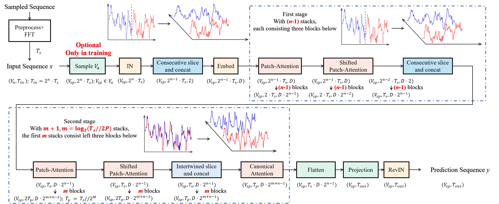
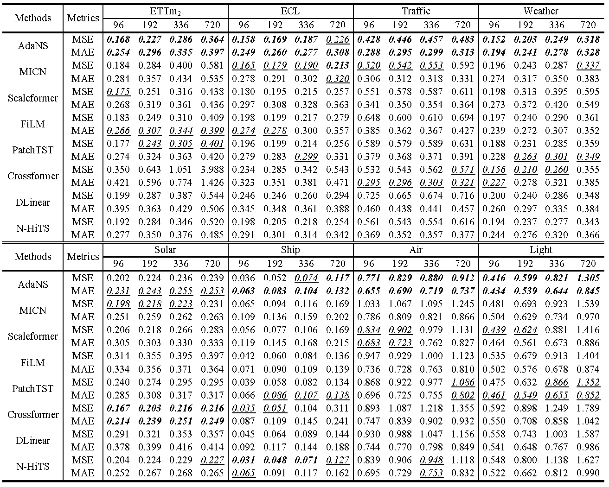
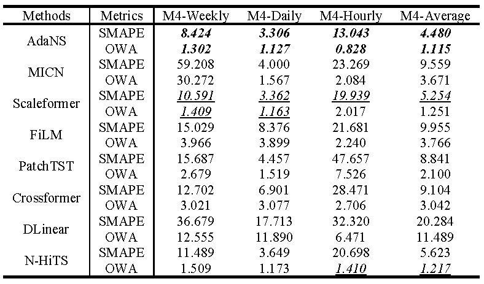

# An Adaptive Network with Consecutive and Intertwined Slices for Real-world Time-Series Forecasting


This is the origin Pytorch implementation of AdaNS in the following paper: 
[An Adaptive Network with Consecutive and Intertwined Slices for Real-world Time-Series Forecasting] (Manuscript submitted to INS).

## The Entire Architecture of AdaNS
The backbone of AdaNS can be divided into two stages, as shown in Figure 1. The input sequence length is assumed to $2^n \cdot T_s$ and variables are categorized into different groups according to different $T_s$. We only discuss the network for an arbitrary variable group with variable numbers $V_a (V_a ≤ V)$ as the networks for other groups are similar. Moreover, we have also mentioned that the input sequence is sliced by half, concatenated to acquire features and embedded to prepare for feature extraction in AdaNS with FVS feature selection strategy. Then, the embedded input tensor is sent to the first stage for universally periodic feature extraction.
<p align="center">

<br><br>
<b>Figure 1.</b> An overview of AdaNS. The size of the feature map is given under every block. The components in the upper dashed box belong to the first stage while those in the lower dashed box are the components of the second stage. The skip-connections with moving average, which are employed in the attention blocks, are omitted. The examples of consecutive slice and intertwined slice processes are given on the top of the corresponding blocks.
</p>


## Requirements

- Python 3.8.8
- matplotlib == 3.3.4
- numpy == 1.20.1
- pandas == 1.2.4
- scipy == 1.9.0
- scikit_learn == 0.24.1
- torch == 1.11.0

Dependencies can be installed using the following command:
```bash
pip install -r requirements.txt
```

## Data

ETT, ECL, Traffic and weather dataset were acquired at: [here](https://drive.google.com/drive/folders/1ZOYpTUa82_jCcxIdTmyr0LXQfvaM9vIy?usp=sharing). Solar dataset were acquired at: [here](https://drive.google.com/drive/folders/1Gv1MXjLo5bLGep4bsqDyaNMI2oQC9GH2?usp=sharing). M4 dataset was acquired at: [M4](https://github.com/Mcompetitions/M4-methods). Ship dataset was in `./data/Ship/` and its raw data was in [https://coast.noaa.gov/hthata/CMSP/AISDataHandler/2022/index.html](https://coast.noaa.gov/hthata/CMSP/AISDataHandler/2022/index.html), the raw data of Air dataset was acquired at: [https://archive.ics.uci.edu/dataset/360/air+quality](https://archive.ics.uci.edu/dataset/360/air+quality) and the raw data of Light dataset was acquired at: [https://archive.ics.uci.edu/dataset/374/appliances+energy+prediction](https://archive.ics.uci.edu/dataset/374/appliances+energy+prediction).

### Data Preparation
After you acquire raw data of all datasets, please separately place them in corresponding folders at `./data`. 

We place ETT in the folder `./ETT-data`, ECL in the folder `./electricity`  and weather in the folder `./weather` of [here](https://drive.google.com/drive/folders/1ZOYpTUa82_jCcxIdTmyr0LXQfvaM9vIy?usp=sharing) (the folder tree in the link is shown as below) into folder `./data` and rename them from `./ETT-data`,`./electricity`, `./traffic` and `./weather` to `./ETT`, `./ECL`, `./Traffic` and`./weather` respectively. We rename the file of ECL/Traffic from `electricity.csv`/`traffic.csv` to `ECL.csv`/`Traffic.csv` and rename its last variable from `OT`/`OT` to original `MT_321`/`Sensor_861` separately.

```
The folder tree in https://drive.google.com/drive/folders/1ZOYpTUa82_jCcxIdTmyr0LXQfvaM9vIy?usp=sharing:
|-autoformer
| |-ETT-data
| | |-ETTh1.csv
| | |-ETTh2.csv
| | |-ETTm1.csv
| | |-ETTm2.csv
| |
| |-electricity
| | |-electricity.csv
| |
| |-traffic
| | |-traffic.csv
| |
| |-weather
| | |-weather.csv
```

We place Solar in the folder `./financial` of [here](https://drive.google.com/drive/folders/1Gv1MXjLo5bLGep4bsqDyaNMI2oQC9GH2?usp=sharing) (the folder tree in the link is shown as below) into the folder `./data` and rename them as `./Solar` respectively. 

```
The folder tree in https://drive.google.com/drive/folders/1Gv1MXjLo5bLGep4bsqDyaNMI2oQC9GH2?usp=sharing:
|-dataset
| |-financial
| | |-solar_AL.txt
```

We place Air/Light in [Air](https://archive.ics.uci.edu/dataset/360/air+quality)/[Light](https://archive.ics.uci.edu/dataset/374/appliances+energy+prediction) (the folder trees in the links are shown as below) into the folder `./data/Air`/`./data/Light`.

```
The folder tree in https://archive.ics.uci.edu/dataset/360/air+quality:
|-air+quality
| |-AirQualityUCI.csv
| |-AirQualityUCI.xlsx

The folder tree in https://archive.ics.uci.edu/dataset/374/appliances+energy+prediction:
|-appliances+energy+prediction
| |-energydata_complete.csv
```

As for M4 dataset, we place the folders `./Dataset` and `./Point Forecasts` of [M4](https://github.com/Mcompetitions/M4-methods) (the folder tree in the link is shown as below) into the folder `./data/M4`. Moreover, we unzip the file `./Point Forecasts/submission-Naive2.rar` to the 
current directory.

```
The folder tree in https://drive.google.com/drive/folders/1Gv1MXjLo5bLGep4bsqDyaNMI2oQC9GH2?usp=sharing:
|-M4-methods
| |-Dataset
| | |-Test
| | | |-Daily-test.csv
| | | |-Hourly-test.csv
| | | |-Monthly-test.csv
| | | |-Quarterly-test.csv
| | | |-Weekly-test.csv
| | | |-Yearly-test.csv
| | |-Train
| | | |-Daily-train.csv
| | | |-Hourly-train.csv
| | | |-Monthly-train.csv
| | | |-Quarterly-train.csv
| | | |-Weekly-train.csv
| | | |-Yearly-train.csv
| | |-M4-info.csv
| |-Point Forecasts
| | |-submission-Naive2.rar
```

Then you can run `./data/preprocess.py` to preprocess the raw data of Air and Light datasets. We replace the missing values, which are tagged with -200 value, by the average values of normal ones. We remove the variable `NMHC(GT)` in Air dataset in that all data of thisvariable in test subset is missing. We remove two random variables, i.e., `rv1` and `rv2`, in Light dataset. After you successfully run `./data/preprocess.py`, you will obtain folder tree:

```
|-data
| |-Air
| | |-Air.csv
| | |-AirQualityUCI.csv
| | |-AirQualityUCI.xlsx
| |
| |-ECL
| | |-ECL.csv
| |
| |-ETT
| | |-ETTh1.csv
| | |-ETTh2.csv
| | |-ETTm1.csv
| | |-ETTm2.csv
| |
| |-Light
| | |-energydata_complete.csv
| | |-Light.csv
| |
| |-M4
| | |-Dataset
| | | |-Test
| | | | |-Daily-test.csv
| | | | |-Hourly-test.csv
| | | | |-Monthly-test.csv
| | | | |-Quarterly-test.csv
| | | | |-Weekly-test.csv
| | | | |-Yearly-test.csv
| | | |-Train
| | | | |-Daily-train.csv
| | | | |-Hourly-train.csv
| | | | |-Monthly-train.csv
| | | | |-Quarterly-train.csv
| | | | |-Weekly-train.csv
| | | | |-Yearly-train.csv
| | | |-M4-info.csv
| | |-Point Forecasts
| | | |-submission-Naive2.csv
| |
| |-Ship
| | |-Ship1.csv
| | |-Ship2.csv
| |
| |-Solar
| | |-solar_AL.txt
| |
| |-Traffic
| | |-Traffic.csv
| |
| |-weather
| | |-weather.csv

```

## Baseline
We select seven typical deep time series forecasting models, i.e., MICN, Scaleformer, FiLM, PatchTST, Crossformer, DLinear and N-HiTS as baselines in multivariate/univariate forecasting experiments. Their source codes origins are given below:

| Baseline | Source Code |
|:---:|:---:|
| MICN | [https://github.com/wanghq21/MICN](https://github.com/wanghq21/MICN) |
| Scaleformer | [https://github.com/BorealisAI/scaleformer](https://github.com/BorealisAI/scaleformer) |
| FiLM | [https://github.com/tianzhou2011/FiLM](https://github.com/tianzhou2011/FiLM) |
| PatchTST | [https://github.com/yuqinie98/PatchTST](https://github.com/yuqinie98/PatchTST) |
| Crossformer | [https://github.com/Thinklab-SJTU/Crossformer](https://github.com/Thinklab-SJTU/Crossformer) |
| DLinear | [https://github.com/cure-lab/LTSF-Linear](https://github.com/cure-lab/LTSF-Linear) |
| N-HiTS | [https://github.com/cchallu/n-hits](https://github.com/cchallu/n-hits) |


Moreover, the default experiment settings/parameters of aforementioned seven baselines are given below respectively:

<table>
<tr>
<th>Baselines</th>
<th>Settings/Parameters name</th>
<th>Descriptions</th>
<th>Default mechanisms/values</th>
</tr>
<tr>
<th rowspan=7>MICN</th>
<th>mode</th>
<th>The mode of trend prediction block</th>
<th>regre</th>
</tr>
<tr>
<th>d_model</th>
<th>The number of hidden dimensions</th>
<th>512</th>
</tr>
<tr>
<th>n_heads</th>
<th>The number of heads in multi-head attention mechanism</th>
<th>8</th>
</tr>
<tr>
<th>d_layers</th>
<th>The number of decoder layers</th>
<th>1</th>
</tr>
<tr>
<th>decomp_kernel</th>
<th>Decomposition kernel size</th>
<th>[17, 49]</th>
</tr>
<tr>
<th>conv_kernel</th>
<th>Downsampling and upsampling convolution kernel size</th>
<th>[12, 16]</th>
</tr>
<tr>
<th>isometric_kernel</th>
<th>Isometric convolution kernel size</th>
<th>[17, 49]</th>
</tr>
<tr>
<th rowspan=2>Scaleformer</th>
<th>scales</th>
<th>Scales in multi-scale</th>
<th>[16, 8, 4, 2, 1]</th>
</tr>
<tr>
<th>scale_factor</th>
<th>Scale factor for upsample</th>
<th>2</th>
</tr>
<tr>
<th rowspan=6>FiLM</th>
<th>d_model</th>
<th>The number of hidden dimensions</th>
<th>512</th>
</tr>
<tr>
<th>d_ff</th>
<th>Dimension of fcn</th>
<th>2048</th>
</tr>
<tr>
<th>n_heads</th>
<th>The number of heads in multi-head attention mechanism</th>
<th>8</th>
</tr>
<tr>
<th>e_layers</th>
<th>The number of encoder layers</th>
<th>2</th>
</tr>
<tr>
<th>d_layers</th>
<th>The number of decoder layers</th>
<th>1</th>
</tr>
<tr>
<th>modes1</th>
<th>The number of Fourier modes to multiply</th>
<th>32</th>
</tr>
<tr>
<th rowspan=2>PatchTST</th>
<th>patch_len</th>
<th>Patch length</th>
<th>16</th>
</tr>
<tr>
<th>stride</th>
<th>The stride length</th>
<th>8</th>
</tr>
<tr>
<th rowspan=5>Crossformer</th>
<th>seq_len</th>
<th>Segment length (L_seq)</th>
<th>6</th>
</tr>
<tr>
<th>d_model</th>
<th>The number of hidden dimensions</th>
<th>64</th>
</tr>
<tr>
<th>d_ff</th>
<th>Dimension of fcn</th>
<th>128</th>
</tr>
<tr>
<th>n_heads</th>
<th>The number of heads in multi-head attention mechanism</th>
<th>2</th>
</tr>
<tr>
<th>e_layers</th>
<th>The number of encoder layers</th>
<th>2</th>
</tr>
<tr>
<th>DLinear</th>
<th>moving_avg</th>
<th>The window size of moving average</th>
<th>25</th>
</tr>
<tr>
<th rowspan=4>N-HiTS</th>
<th>n_pool_kernel_size</th>
<th>Pooling kernel size</th>
<th>[4, 4, 4]</th>
</tr>
<tr>
<th>n_blocks</th>
<th>The number of blocks in stacks</th>
<th>[1, 1, 1]</th>
</tr>
<tr>
<th>n_x_hidden</th>
<th>Coefficients hidden dimensions</th>
<th>512</th>
</tr>
<tr>
<th>n_freq_downsample</th>
<th>The number of stacks' coefficients</th>
<th>[60, 8, 1]</th>
</tr>
</table>


## Usage
Commands for training and testing AdaNS of different datasets are respectively in the files `./scripts/<data>.sh`.

More parameter information please refer to `main.py`.

We provide a complete command for training and testing AdaNS:

For multivariate forecasting:
```
python -u main.py --data <data> --features <features> --root_path <root_path> --Period_Times <Period_Times> --short_input_len <short_input_len> --pred_len <pred_len> --attn_pieces <attn_pieces> --learning_rate <learning_rate> --dropout <dropout> --Sample_strategy <Sample_strategy> --n_heads <n_heads> --sample_train <sample_train> --batch_size <batch_size> --train_epochs <train_epochs> --patience <patience> --itr <itr>
```

For univariate forecasting:
```
python -u main_M4.py --data <data> --features <features> --root_path <root_path> --Period_Times <Period_Times> --short_input_len <short_input_len> --pred_len <pred_len> --attn_pieces <attn_pieces> --learning_rate <learning_rate> --dropout <dropout> --Sample_strategy <Sample_strategy> --n_heads <n_heads> --sample_train <sample_train> --batch_size <batch_size> --train_epochs <train_epochs> --patience <patience> --itr <itr>
```

Here we provide a more detailed and complete command description for training and testing the model:

| Parameter name |Description of parameter|
|:---:|:----------------------------------------------------------------------------------------------------------:|
|      data      |  The dataset name  |
|   root_path    |The root path of the data file|
|   data_path    | The data file name |
|    features    | The forecasting task. This can be set to `M`,`S` (M : multivariate forecasting, S : univariate forecasting |
|     target     |Target feature in `S` task|
|  checkpoints   |Location of model checkpoints |
|  tuned_checkpoints   |Location of tuned model checkpoints |
| sample_train | The length of sampled sequence to seek $f_s$ and $T_s$|
| lmb |𝜆, one of the hyper-parameters used in outlier filter(year=6.25, season=1600, month=129600) |
| c | One of the hyper-parameters used in outlier filter|
| piece_len |The length of Ts, acqured by latter codes |
| Period_Times |The value of I|
| Sample_strategy |Sampling strategy in SCMA |
| short_input_len |Short input length for variable|
| pred_len |Prediction sequence length|
| c_in |     Input size     |
| c_out |    Output size     |
| w_random |    Whether to train with partial variables    | 
| rand_thres |    Threshold variable number determining whether to use w_random   |
| factor |    b, used in the method of sampling variables during training for datasets with large variable numbers   |
| d_model |  The hidden dimension of model|
| attn_pieces | The number of patches |
| n_heads |  The number of heads |
| attn_nums1 | Attention blocks of the first stage, acquired adaptivity |
| attn_nums2 | Attention blocks of the second stage, acquired adaptivity |
| dropout |      Dropout       |
| itr | Experiments times  |
| train_epochs |  Train epochs  |
| batch_size |                         The batch size of training input data |
| patience |Early stopping patience |
| learning_rate |Optimizer learning rate |
| loss |   Loss function    |
| load_tuned | Whether to load the tuned checkpoints|


## Results

The experiment parameters of each dataset are formated in the files within the directory `./scripts/`. You can refer to these parameters for experiments, and you can also adjust the parameters to obtain better mse and mae results or draw better prediction figures. We provide the commands for obtain the results of AdaNS with hyper-parameters fine-tuning of ETT datasets in the files `./scripts/Tuned.sh` and the corresponding checkpoints in the directory `./tuned_checkpoints/`. 

<p align="center">

<br><br>
<b>Figure 2.</b> Multivariate forecasting results
</p>

<p align="center">

<br><br>
<b>Figure 3.</b> Univariate forecasting results
</p>


## Contact
If you have any questions, feel free to contact Li Shen through Email (shenli@buaa.edu.cn) or Github issues. Pull requests are highly welcomed!
